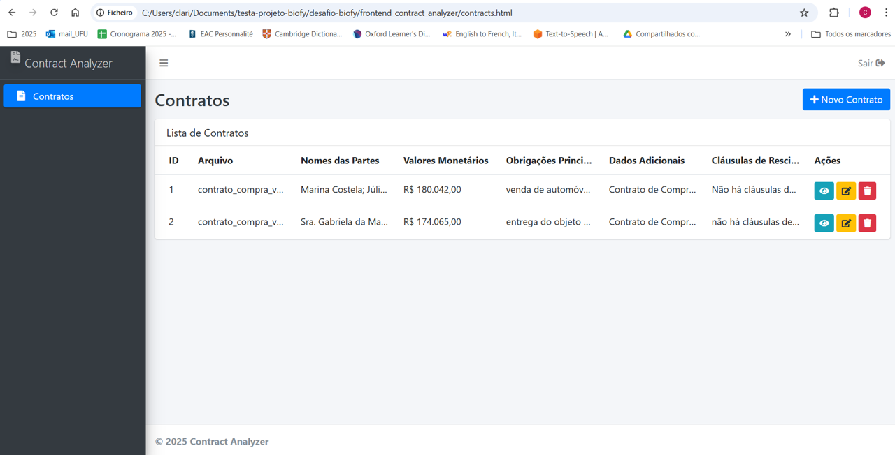

# Contract Analyzer API

**Contract Analyzer** é uma API RESTful desenvolvida com **FastAPI** para automatizar o upload e análise de contratos em formato **PDF** ou **DOCX**.  
A API processa o conteúdo do contrato usando **Inteligência Artificial (Groq API com LLaMA 3)** para extrair informações-chave e armazena os dados em um banco de dados SQLite para consulta posterior.

---

## Funcionalidades

- Autenticação com **JWT** (JSON Web Token)
- Upload de contratos **(.pdf/.docx)**
- Análise com IA para extrair:
  - Nomes das partes
  - Valores monetários
  - Obrigações principais
  - Dados adicionais (ex.: objeto e vigência)
  - Cláusulas de rescisão
- Persistência no banco de dados SQLite
- Consulta e gerenciamento de contratos: listar, buscar, atualizar e excluir por meio de uma interface

---

## Tecnologias Utilizadas

- **Python 3.x**
- **FastAPI**
- **SQLite** (via SQLAlchemy)
- **PyJWT** para autenticação
- **Groq API** com LLaMA 3 para análise de contratos
- **PyPDF2** e **python-docx** para leitura de arquivos

---

## Instalação e Configuração

### Pré-requisitos

- Python 3.10+  

---

### Instalação local

1. **Clone o repositório**
   ```bash
   git clone https://github.com/clarivando/desafio-biofy.git
   cd desafio-biofy
   ```

2. **Crie e ative o ambiente virtual**
   ```bash
   python -m venv venv
   source venv/bin/activate  # Linux/Mac
   venv\Scripts\activate   # Windows
   ```

3. **Instale as dependências**
   ```bash
   pip install -r requirements.txt
   ```

4. **Crie e configure o arquivo .env dentro de contract_analyzer**
   #### 4.1 JWT configs
   - SECRET_KEY=sua-chave-jwt
   - ALGORITHM=HS256
   - ACCESS_TOKEN_EXPIRE_MINUTES=600

   #### 4.2 Banco de dados
   - DATABASE_URL=sqlite:///./db.sqlite3

   #### 4.3 Configuração do Groq API
   - GROQ_API_KEY=sua-chave-groq-aqui
   - GROQ_MODEL=llama3-70b-8192  # ou llama3-8b-8192 para modelo menor

5. **Inicie o servidor**
   ```bash
   cd contract_analyzer
   uvicorn app.main:app --reload
   ```

6. **Acesse a documentação interativa:**
   [http://127.0.0.1:8000/docs](http://127.0.0.1:8000/docs)
   - Cadastre um novo usuário na rota POST /users/register. Veja o exemplo:
   ```
    {
      "username": "clarivando",
      "full_name": "Clarivando Francisco",
      "email": "clarivando@ufu.br",
      "password": "123456"
    }
   ```
   - Em seguida, faça login (POST /login) para obter o token de acesso às rotas.

---

## Acesso à Interface Web

A aplicação conta com uma **interface web** para facilitar o uso da API:  




1. **Abrir a interface**
   - Navegue até a pasta `frontend_contract_analyzer`.
   - Localize o arquivo `index.html`.
   - Abra o `index.html` em um navegador moderno (Google Chrome recomendado).

2. **Tela de Login**
   - Ao abrir, você será direcionado para a tela de login.
   - **Opções de acesso:**
     - **Usuário de teste (se já estiver cadastrado):**
       ```
       Email: clarivando@ufu.br
       Senha: 123456
       ```
     - **Criar novo usuário:** utilize o botão de cadastro para criar uma conta própria.

3. **Tela Principal**
   - Após o login, a tela principal lista todos os contratos disponíveis no sistema.

4. **Funcionalidades**
   - **Visualizar detalhes** de um contrato clicando sobre ele.
   - **Editar** ou **Excluir** contratos existentes.
   - **Cadastrar novo contrato:** clique no botão **“Novo Contrato”**, selecione um arquivo **`.pdf` ou `.docx`**, e o sistema fará o upload e análise automática com IA para extrair informações relevantes.

---

## Autor

**Clarivando Francisco Belizário Junior**
